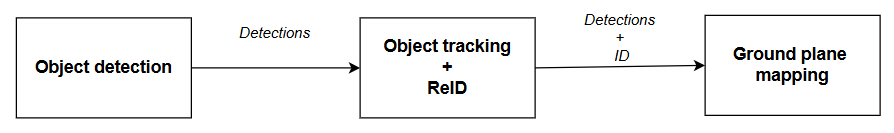
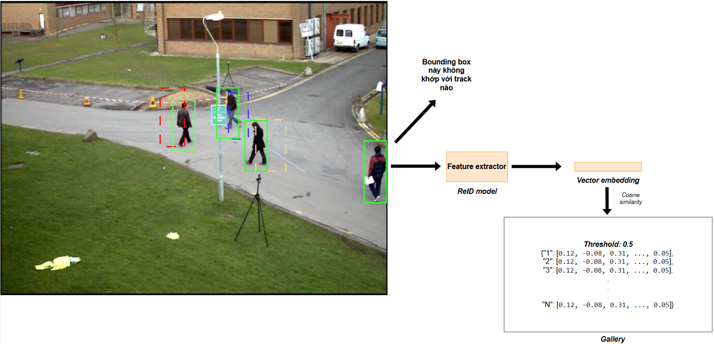
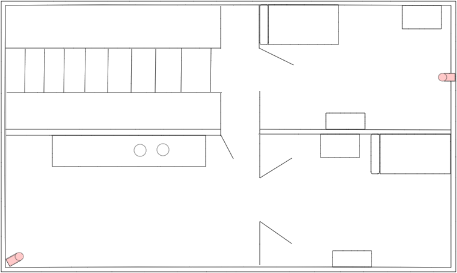
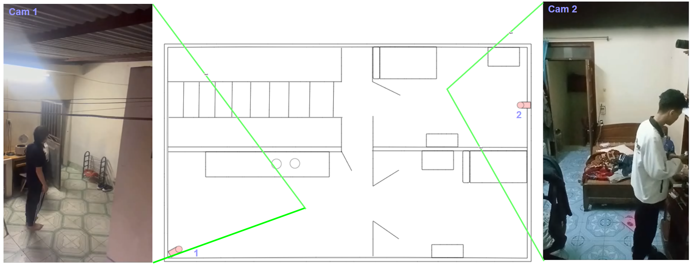
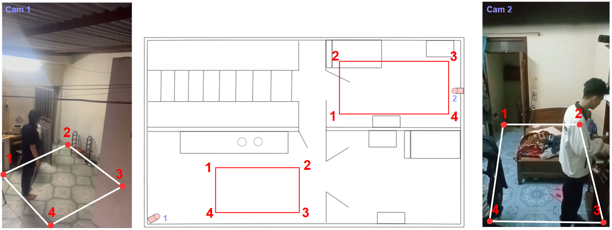
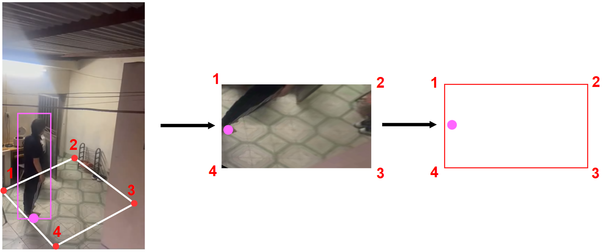
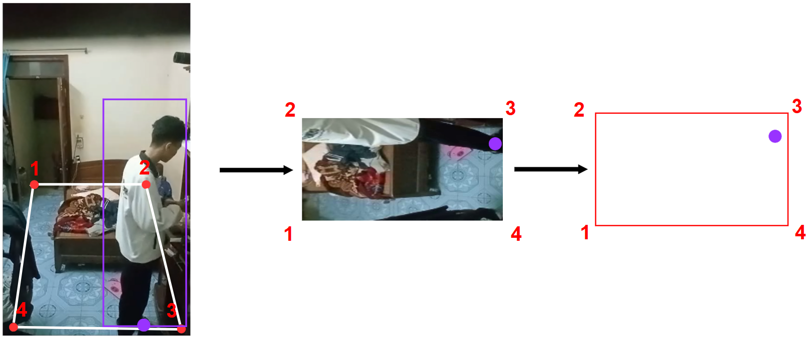
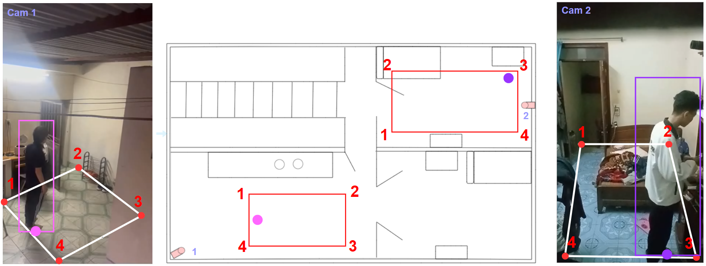
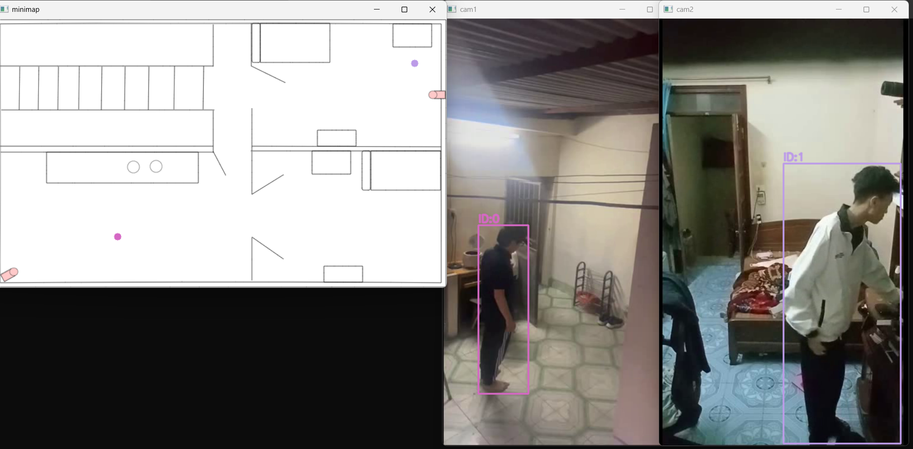
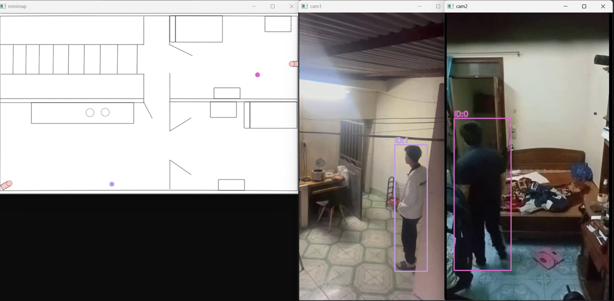

# Multi-Camera Tracking

A cross-camera multi-person tracking system that combines **YOLOv8** object detection, **DeepSORT**-style tracking with Kalman filters, and a custom **ReID (Re-Identification)** model based on ResNet50 + BNNeck. The system maintains a cross-camera gallery of appearance embeddings so that when a person exits one camera view and enters another, they are re-identified and assigned the same global track ID.

I would like to thank one of my best friends, Nguyen Duc Anh Quan (KumDen) for helping me create the experimental videos.

## Overview

The simple pipeline consists of 3 phases: Object detection, Object tracking + ReID, 2D Ground plane mapping (Homography)



### Object tracking + ReID phase

Here is how the Object tracking + ReID phase implemented. A cross-camera gallery is used to store feature vectors of each target for querying. Whenever getting an unmatched detections, compare its feature vector with feature vectors stored inside the gallery to reassign old IDs if that detections already appeared once in the past else new IDs.



### 2D Ground plane mapping phase

Here is the map used for 2D mapping (self drawn).



The position of cameras is as below:



For mapping, we must first configure the source mapping region and target mapping region. 



Then take the bottom-mid of bounding boxs as an approximation for that targets to map.




Here is the result.



## Demo result

This is a demo of the project at two different points in time.



## Project Structure

### Root Files

| File | Description |
|---|---|
| `main.py` | Legacy entry point — hardcoded paths, two-camera pipeline |
| `run_trackers.py` | New entry point — loads config from `configs/main_config.yaml`, runs two-camera pipeline |
| `visualize.py` | Interactive OpenCV visualization with minimap, track overlay, and click-to-focus on any track ID |
| `ui.py` | Streamlit web UI — configurable paths sidebar, renders combined camera views + minimap into an output video |
| `ultilities.py` | Helper functions: deterministic track coloring, homography projection, JSONL track loading, drawing utilities |
| `pyproject.toml` | Project metadata (name, version, Python >=3.12) |

### `tracker/` — Core Tracking Module

| File | Description |
|---|---|
| `detector.py` | `YOLOv8Detector` — wraps Ultralytics YOLOv8, filters detections by COCO class name, returns `(N, 5)` arrays `[x1, y1, x2, y2, confidence]` |
| `kalman_filter.py` | `KalmanBoxTracker` — per-object Kalman filter (constant velocity, 7-D state). Also contains `iou_batch`, `cosine_distance_matrix`, `combined_cost_matrix`, and `associate_detections_to_trackers` (Hungarian matching with IoU gating) |
| `multicamera_deepsort.py` | `MultiCameraDeepSORT` — the main tracker. Supports three gallery modes: `"build"` (cam1, store features), `"query"` (cam2+, match against gallery), `"both"` (query existing + add new). Handles prediction, association, reID, and gallery population |
| `gallery.py` | `CrossCameraGallery` — stores `{global_id: np.ndarray(K, D)}` feature matrices. Supports `query(feature)` → `(best_id, min_dist)`, `add_track()`, `mark_active/mark_inactive`, and `save/load` via pickle |
| `feature_extractor.py` | `CustomReIDFeatureExtractor` — loads a `ReIDModel` checkpoint, crops/resizes/normalizes bounding boxes, runs inference, returns L2-normalized 2048-D features |
| `run_pipeline.py` | `run()` function — opens two video captures, creates per-camera detector + tracker, loops frame-by-frame calling detect → update → export JSONL |
| `ultilities.py` | `get_color` (deterministic per ID), `draw_tracks` (bbox + label), `append_tracks_jsonl` (write per-frame track records) |

### `reid/` — Re-Identification Model & Training

| File | Description |
|---|---|
| `model.py` | `ReIDModel` — ResNet50 backbone (ImageNet pretrained) with last-stride=1, AdaptiveAvgPool2d, and `BNNeck` module. `forward()` returns `(ft, fi, logits)`; `inference()` returns L2-normalized `fi` for retrieval |
| `training.py` | Full training pipeline: `RandomIdentitySampler` (P=16, K=4), ResNet50 backbone, triplet + center + label-smoothing CE losses, Adam optimizer, warmup LR scheduler (10-epoch linear warmup, decay at epoch 40/70). Saves best and periodic checkpoints |
| `inference.py` | Standalone inference helpers: `load_model_for_inference` (load checkpoint → eval mode), `build_inference_transform` (resize 256×128 + normalize) |
| `benchmark.py` | `run_benchmark()` — evaluates trained ReID model on a query/gallery split. Computes **mAP**, **Rank-1**, and **CMC curve**. Configurable via `configs/benchmark_config.yaml` |
| `metrics.py` | Evaluation metrics: `collect_images_with_subfolder` (recursive image loader with pid/cam parsing), `extract_features` (batch feature extraction), `evaluate` (mAP + CMC with DukeMTMC protocol: same-pid-different-cam = positive, same-pid-same-cam = junk), `debug_evaluation_setup` (prints dataset statistics) |
| `sampler.py` | `RandomIdentitySampler` — yields `P * K` indices per batch: randomly selects P identities, then K images per identity (with repetition if needed) |
| `loss.py` | Three loss functions: `LabelSmoothingCE` (ε=0.1), `TripletLossHardMining` (margin=0.3, hard-positive/negative mining), `CenterLoss` (β=0.0005) |

### `configs/` — YAML Configuration

| File | Description |
|---|---|
| `main_config.yaml` | Main pipeline config: weight paths, video paths, ReID params (`num_classes`, `input_size`, `feature_dim`, `threshold`), tracker params (`max_age`, `target_classes`) |
| `benchmark_config.yaml` | Benchmark config: model path, query/gallery directories, image size, batch size, `max_rank`, `debug` flag |
| `reid_config.yaml` | Training config: data/save directories, training hyperparameters (epochs, P, K, LR, weight decay, loss params) |
| `mapping_config.yaml` | Visualization config: minimap path, homography source/destination points for each camera |
| `load_config.py` | `load_config(path)` — utility to load any YAML config file using PyYAML |
| `tracker_config.yaml` | *(empty)* Placeholder |
| `pipeline_config.yaml` | *(empty)* Placeholder |

### `tools/` — Utilities

| File | Description |
|---|---|
| `mapping_src_dest.py` | Interactive OpenCV tool for homography calibration. Click 4 source points on each camera view, then 4 corresponding destination points on the minimap. Press `p` to print the resulting `np.array` coordinates ready for copy-paste into `visualize.py` or `mapping_config.yaml` |

### `results/` — Output

| File | Description |
|---|---|
| `tracks.jsonl` | Track results in JSONL format — one line per detection per frame |
| `tracks2.jsonl` | Secondary run output used by `visualize.py` and `ui.py` by default |

### `weights/` — Model Weights

| Path | Description |
|---|---|
| `weights/detector/` | YOLOv8 model files (e.g. `yolov8m.pt`) |
| `weights/reid/` | Custom ReID checkpoints (e.g. `model01.pth`) |

### `videos/` — Input Videos

| File | Description |
|---|---|
| `videos/vid1_2.avi` | Camera 1 footage |
| `videos/vid2_2.avi` | Camera 2 footage |
| `videos/video1_crop.avi` | Alternate Camera 1 footage (used by legacy `main.py`) |
| `videos/video2_crop.avi` | Alternate Camera 2 footage (used by legacy `main.py`) |

### `map/` — Minimap

| File | Description |
|---|---|
| `map/mymapv10.png` | Top-down view minimap for projecting track positions via homography |

## ReID Model Details

The `ReIDModel` in `reid/model.py` implements several tricks from the person ReID literature:

| Trick | Implementation |
|---|---|
| **Last Stride = 1** | Removes the final spatial downsampling in ResNet50 `layer4`, producing a 16×8 feature map instead of 8×4 |
| **BNNeck** | BatchNorm after global pooling separates the feature space: `ft` (before BN) is used for triplet/center loss, `fi` (after BN) is used for classification and retrieval |
| **Label Smoothing** | `LabelSmoothingCE` with ε=0.1 prevents over-confidence on the classification head |
| **Hard Triplet Mining** | `TripletLossHardMining` picks the hardest positive (farthest same-ID pair) and hardest negative (closest different-ID pair) within each batch |
| **Center Loss** | `CenterLoss` learns a centroid per identity and penalizes feature-to-centroid distances, improving intra-class compactness |
| **Warmup LR** | Linear warmup over 10 epochs, then constant LR, then 10× decay at epoch 40 and 100× decay at epoch 70 |

**Inference output**: 2048-D L2-normalized vector suitable for cosine similarity search.

## Benchmarking

Evaluate a trained ReID model on DukeMTMC or any query/gallery split:

```
python reid/benchmark.py
```

Configure `configs/benchmark_config.yaml`:

```yaml
benchmark:
  model_path: "weights/reid/model01.pth"
  query_dir: "data/query"
  gallery_dir: "data/gallery"
  num_classes: 702
  img_h: 256
  img_w: 128
  batch_size: 64
  id_from: "folder"       # "folder" or "filename"
  max_rank: 50
  debug: true
```

Outputs: mAP (%), Rank-1 (%), and CMC at ranks 5 and 10.

### Evaluation Protocol (`reid/metrics.py`)

- **Positive match**: same `pid`, different `cam`
- **Junk**: same `pid`, same `cam` (ignored in ranking)
- **mAP**: mean Average Precision over all queries
- **CMC**: Cumulative Matching Characteristic (probability of correct match within top-K)

Image naming convention: `_c{cam_id}` in filename for camera parsing. PID is read from parent folder name (`id_from="folder"`) or leading digits of filename (`id_from="filename"`).

## Usage

### Run the Tracking Pipeline (recommended)

```bash
python run_trackers.py
```

Configures everything via `configs/main_config.yaml`. Processes two videos and exports JSONL.

### Run the Legacy Pipeline

```bash
python main.py
```

Hardcoded paths — processes `videos/video1_crop.avi` and `videos/video2_crop.avi`.

### Train the ReID Model

Edit `configs/reid_config.yaml` (set `data_dir` and `save_dir`), then:

```bash
python -c "from reid.training import train; train()"
```

To resume from a checkpoint:

```bash
python -c "from reid.training import train; train(resume='./checkpoints/epoch_050.pth')"
```

### Interactive OpenCV Visualization

```bash
python visualize.py
```

Shows two camera views + minimap. Controls:

| Key | Action |
|---|---|
| Left-click on a bbox | Focus on that track ID (all views show only that ID) |
| `Space` | Pause / Resume |
| `R` | Reset focus (show all tracks) |
| `Q` / `ESC` | Quit |

### Streamlit Web UI

```bash
streamlit run ui.py
```

Sidebar inputs for video/JSONL/minimap paths. Click **Render Video** to generate a combined output video (cam1 + cam2 + minimap side-by-side) with track overlays.

### Homography Calibration

```bash
python tools/mapping_src_dest.py
```

Four modes cycled with `n`: `cam1_src` → `cam1_dst` → `cam2_src` → `cam2_dst`. For each mode, left-click 4 points. Press `p` to print the `np.array` definitions ready to paste into `mapping_config.yaml` or `visualize.py`.

## Output Format (JSONL)

```
{"frame": 0, "cam": "cam1", "id": 3, "bbox_xyxy": [100.0, 200.0, 150.0, 350.0]}
{"frame": 0, "cam": "cam2", "id": 7, "bbox_xyxy": [200.0, 150.0, 260.0, 300.0]}
```

Fields:
- `frame` — 0-indexed frame number
- `cam` — camera name (`"cam1"` or `"cam2"`)
- `id` — global track ID (consistent across cameras if re-identified)
- `bbox_xyxy` — bounding box in `[x1, y1, x2, y2]` format

## Key Parameters

| Parameter | Default | Description |
|---|---|---|
| `conf_threshold` | 0.75 | YOLOv8 confidence threshold |
| `nms_iou_threshold` | 0.4 | YOLOv8 NMS IoU threshold |
| `max_age` | 15 | Frames before a lost track is deleted |
| `min_hits` | 3 | Consecutive detections to confirm a track |
| `iou_threshold` | 0.3 | Minimum IoU for Hungarian matching gate |
| `lambda_iou` | 0.4 | IoU cost weight in combined cost |
| `lambda_app` | 0.6 | Appearance cost weight in combined cost |
| `reid_threshold` | 0.7 | Max cosine distance to accept cross-camera match |
| `feature_dim` | 2048 | ReID embedding dimensionality |